# Pengantar
Selamat! Anda telah berhasil menuntaskan seluruh materi kelas Membangun Sistem Machine Learning. Pencapaian ini merupakan buah dari dedikasi dan ketekunan Anda dalam menyelami konsep yang tidak hanya mencakup pembangunan model, melainkan juga penerapan Machine Learning Operations (MLOps) secara menyeluruh. 

Keberhasilan ini patut dirayakan karena Anda telah berupaya mempelajari beragam aspek penting, mulai dari pemahaman mengenai DevOps dan evolusinya menjadi MLOps, kemudian merambah ke persoalan umum dalam pengembangan machine learning.

Selama meniti pembelajaran ini, Anda telah memperkuat wawasan mengenai beragam perangkat pendukung seperti git, DVC, MLflow, Docker, dan Kubernetes, beserta alat eksperimentasi, penelusuran metadata, dan lingkungan eksekusi model yang bermanfaat untuk menjaga kualitas dan stabilitas sistem machine learning. 

Anda juga telah memahami pentingnya mengumpulkan dan mempersiapkan data secara komprehensif agar model yang dibangun, baik statis maupun dinamis, dapat mencapai performa optimal. 

Selain itu, Anda telah dibekali kemampuan menyajikan model sebagai API dengan memanfaatkan MLflow, FastAPI, dan Docker agar proses deployment berjalan stabil dan konsisten. 

Kesadaran akan pentingnya memantau kinerja model pun telah Anda asah, terutama dengan bantuan Prometheus dan Grafana untuk mendeteksi potensi drift, memantau sumber daya sistem, serta mengelola alerting yang sigap terhadap penurunan performa.

Untuk menyempurnakan perjalanan Anda dalam kelas ini, tantangan terakhir menanti. Anda diminta membangun sebuah sistem machine learning yang andal dan siap masuk tahap produksi, mencakup seluruh tahapan mulai dari pengumpulan data, pelatihan model, penelusuran metadata, hingga deployment dan monitoring yang aktif. 

Pastikan Anda mengerahkan seluruh pengetahuan dan keterampilan yang telah diraih. Bacalah dengan cermat panduan di halaman berikutnya agar rancangan proyek Anda selaras dengan kriteria yang ditetapkan. Teruslah menapaki karier di dunia machine learning dan tunjukkan karya terbaik Anda. Kami tunggu kabar terbaik dari Anda, semangat!


# Kriteria

Setiap kriteria dapat bernilai 0 sampai 4 points (pts). Untuk lulus dari submission ini, Anda harus mendapatkan 2 points dari setiap kriteria. Submission akan ditolak jika masih terdapat kriteria dengan 0 points. 

WAJIB DIPERHATIKAN!

Mohon periksa tab “Lainnya” untuk memeriksa ketentuan pengiriman submission lebih lanjut.


## Kriteria 1: Melakukan Eksperimen terhadap Dataset Pelatihan
Kriteria pertama merupakan senjata utama untuk menyelesaikan submission kelas ini. Hal ini sangat berguna sebagai eksplorasi dan eksperimen awal sebelum Anda melakukan otomatisasi pada kriteria berikutnya.

Pada tahap ini, Anda wajib menggunakan Template Eksperimen MSML (https://colab.research.google.com/drive/1vSTQWWgGqPGBGHvv8lbeGdoa5N92D_UC?usp=sharing) sebagai panduan awal sebelum membuat file untuk melakukan otomatisasi data preprocessing. Pastikan template tersebut diikuti dengan benar untuk memastikan proses berjalan sesuai standar yang ditetapkan. 

Setelah melakukan eksplorasi, Anda telah memiliki panduan utama untuk membuat file yang dapat melakukan preprocessing data secara otomatis. Selanjutnya, silakan konversi langkah-langkah yang ada pada notebook eksperimen untuk membuat file otomatisasi tersebut.

Pada akhirnya agar dapat memenuhi kriteria ini, Anda harus membuat sebuah repository (GitHub dan lokal) dengan struktur seperti ini.

Eksperimen_SML_Nama-siswa
├── .workflow (jika menerapkan advance)
├── namadataset_raw (bisa berupa file atau folder)
├── preprocessing
    └── Eksperimen_Nama-siswa.ipynb
    └── automate_Nama-siswa.py (jika menerapkan skilled)
    └── namadataset_preprocessing (bisa berupa file atau folder)
Berikut adalah penilaian lengkap untuk kriteria 1:

Reject (0 pts)

Tidak melakukan seluruh tahapan experimentation yang ada pada template secara manual. 

Tidak melakukan data loading pada notebook. 

Tidak melakukan EDA pada notebook.

Tidak melakukan preprocessing pada notebook.

Basic (2 pts)

Melakukan tahapan experimentation secara manual.

Melakukan data loading pada notebook.

Melakukan EDA pada notebook.

Melakukan preprocessing pada notebook.

Skilled (3 pts)

Tahap basic terpenuhi.

Membuat sebuah file automate_Nama-siswa.py yang berisikan fungsi untuk melakukan preprocessing secara otomatis sehingga mengembalikan data yang siap dilatih.

Pada tahap ini Anda harus melakukan konversi dari proses eksperimen sebelumnya, sehingga tahapannya harus sama tetapi memiliki struktur yang berbeda.

Advance (4 pts)

Tahap skilled terpenuhi.

Membuat sebuah workflow pada GitHub Actions agar dapat melakukan preprocessing setiap kali trigger terpantik.

Anda harus membuat sebuah repository dengan nama Eksperimen_SML_Nama-siswa berisi seluruh file yang sama dengan rekomendasi struktur folder pada kriteria 1.

Pastikan Actions yang dibuat mengembalikan sebuah dataset terbaru yang sudah diproses sedemikian rupa.


## Kriteria 2: Membangun Model Machine Learning
Setelah selesai melalui tahapan preprocessing, Anda harus melatih model menggunakan dataset yang sudah siap digunakan (bukan raw). Nantinya Anda harus membuat sebuah folder yang berisikan file modelling.py beserta dependencies nya dengan struktur seperti berikut.

Membangun_model
├── modelling.py
├── modelling_tuning.py (jika menerapkan skilled/advanced)
├── namadataset_preprocessing (bisa berupa file atau folder)
├── screenshoot_dashboard.jpg
├── screenshoot_artifak.jpg
├── requirements.txt
├── DagsHub.txt (berisikan tautan DagsHub jika menerapkan advanced)
Sebagai informasi, tahapan ini dapat Anda jalankan pada lokal environment sebagai jembatan penghubung ke kriteria tiga.

Berikut adalah penilaian lengkap untuk kriteria 2:

Reject (0 pts)

Tidak membuat model machine learning/deep learning menggunakan MLflow dan menyimpan artefak di MLflow Tracking UI.

Tidak menyimpan informasi apa pun pada logging.

Basic (2 pts)

Melatih model machine learning (Scikit-Learn) menggunakan MLflow Tracking UI yang disimpan secara lokal tanpa menggunakan hyperparameter tuning.

Menggunakan autolog dari MLflow pada file modelling.py.

Mengirimkan screenshot yang valid.

Skilled (3 pts)

Kriteria Basic wajib terpenuhi.

Melatih model machine learning/deep learning menggunakan MLflow Tracking UI yang disimpan secara lokal dengan menerapkan hyperparameter tuning.

Alih-alih menggunakan autolog, Anda diharapkan menggunakan manual logging dengan metriks yang sama dengan autolog.

Pastikan kamu melakukan checklist ini pada file modelling_tuning (bukan pada modelling.py)

Advance (4 pts)

Melatih model machine learning/deep learning menggunakan MLflow Tracking UI yang disimpan secara online dengan DagsHub.

Alih-alih menggunakan autolog, siswa diharapkan menggunakan manual logging dengan metriks yang tidak hanya tercover pada autolog (autolog + minimal 2 artefak tambahan).


## Kriteria 3: Membuat Workflow CI
Setelah membuat dan memastikan file modelling.py berjalan dengan baik, selanjutnya Anda harus membuat workflow CI menggunakan MLflow Project agar dapat melakukan re-training model secara otomatis ketika trigger dipantik. 

Silakan Anda buat sebuah project repository baru di GitHub dengan struktur seperti berikut ini.

Workflow-CI
├── .workflow
├── MLProject (folder)
    └── modelling.py
    └── conda.yaml
    └── MLProject
    └── namadataset_preprocessing (bisa berupa file atau folder)
    └── Tautan ke Docker Hub
    └── (file tambahan jika diperlukan)
Anda dapat menggunakan file modelling.py, conda.yaml serta dataset yang sudah siap dilatih dari hasil eksperimen sebelumnya. Pada tahap ini, Anda hanya perlu membuat struktur yang diminta beserta file MLProjectnya saja. Namun, tidak menutup kemungkinan Anda harus menyesuaikan file modelling.py ketika masuk ke tahap ini.

Berikut adalah penilaian lengkap untuk kriteria 3:

Reject (0 pts)

Tidak membuat folder MLProject.

Tidak membuat workflow CI menggunakan GitHub Actions.

Basic (2 pts)

Membuat folder MLProject.

Membuat Worflow CI yang dapat membuat model machine learning ketika trigger terpantik.

Skilled (3 pts)

Membuat workflow CI dan menyimpan artefak ke suatu repositori (GitHub yang sama atau Google Drive).

Advance (4 pts)

Membuat workflow CI dan menyimpan artefak ke suatu repositori (GitHub yang sama atau Google Drive) serta membuat Docker Images ke Docker Hub menggunakan fungsi mlflow build-docker.


## Kriteria 4: Membuat Sistem Monitoring dan Logging
Monitoring dan Logging merupakan tahapan yang tidak bisa berdiri sendiri karena membutuhkan artefak yang dihasilkan oleh kriteria tiga. Nantinya, Anda hanya akan mengumpulkan tangkapan layar mengenai skill yang diampu dengan struktur seperti berikut ini.

Monitoring dan Logging
├── 1.bukti_serving
├── 2.prometheus.yml
├── 3.prometheus_exporter.py
├── 4.bukti monitoring Prometheus (folder)
    └── 1.monitoring_<metriks>
    └── 2.monitoring_<metriks>
    └── dst (sesuaikan dengan poin yang diraih)
├── 5.bukti monitoring Grafana (folder)
    └── 1.monitoring_<metriks>
    └── 2.monitoring_<metriks>
    └── dst (sesuaikan dengan poin yang diraih)
├── 6.bukti alerting Grafana (folder)
    └── 1.rules_<metriks>
    └── 2.notifikasi_<metriks>
    └── 3.rules_<metriks>
    └── 4.notifikasi_<metriks>
    └── dst (sesuaikan dengan poin yang diraih)
├── 7.inference.py
├── folder/file tambahan
Penting, pastikan untuk membuat dashboard dengan nama username akun Dicoding sehingga tangkapan layar yang Anda kirimkan akan berisikan kredensial.

Berikut adalah penilaian lengkap untuk kriteria 4:

Reject (0 pts)

Tidak melakukan serving model pada environment local.

Tidak melakukan monitoring performa sistem machine learning menggunakan Prometheus

Tidak menggunakan Grafana sebagai tools visualisasi dan alerting sistem machine learning

Basic (2 pts)

Melakukan serving model baik itu melalui artefak yang sudah dibuat atau pull Images (jika menerapkan kriteria CI untuk melakukan push ke Docker Hub)

Bisa melalui mlflow model serve, mlflow deployments, atau pull images jika memenuhi kriteria 3 advanced.

Melakukan monitoring menggunakan Prometheus minimal dengan tiga metriks yang berbeda.

Melakukan monitoring menggunakan Grafana dengan metriks yang sama dengan Prometheus.

Skilled (3 pts)

Melakukan monitoring menggunakan Grafana dengan minimal 5 metriks yang berbeda.

Membuat satu alerting menggunakan Grafana.

Advance (4 pts)

Melakukan monitoring menggunakan Grafana dengan minimal 10 metriks yang berbeda.

Membuat tiga alerting menggunakan Grafana.


# Tips dan Trik
Anda disarankan menggunakan environment berikut untuk menunjang submission:

Python 3.12.7

mlflow==2.19.0

Jika Anda menggunakan data unstructured dan menggunakan framework TensorFlow, silakan sesuaikan beberapa tahapan, tetapi tetap mengacu ke masing-masing objektif kriteria.

Format pengiriman submission.
SMSML_Nama-siswa
├── Eksperimen_SML_Nama-siswa.txt
├── Membangun_model
    ├── modelling.py
    ├── modelling_tuning.py (skilled/advanced)
    ├── namadataset_preprocessing (bisa berupa file atau folder)
    ├── screenshoot_dashboard.jpg
    ├── screenshoot_artifak.jpg
    ├── requirements.txt
    ├── DagsHub.txt (berisikan tautan DagsHub jika menerapkan advanced)
├── Workflow-CI.txt
├── Monitoring dan Logging
    ├── 1.bukti_serving
    ├── 2.prometheus.yml
    ├── 3.prometheus_exporter.py
    ├── 4.bukti monitoring Prometheus (folder)
        └── 1.monitoring_<metriks>
        └── 2.monitoring_<metriks>
        └── dst (sesuaikan dengan poin yang diraih)
    ├── 5.bukti monitoring Grafana (folder)
        └── 1.monitoring_<metriks>
        └── 2.monitoring_<metriks>
        └── dst (sesuaikan dengan poin yang diraih)
    ├── 6.bukti alerting Grafana (folder)
        └── 1.rules_<metriks>
        └── 2.notifikasi_<metriks>
        └── 3.rules_<metriks>
        └── 4.notifikasi_<metriks>
        └── dst (sesuaikan dengan poin yang diraih)
    ├── 7.Inference.py
    ├── folder/file tambahan
Catatan

Eksperimen_SML_Nama-siswa.txt berisikan tautan ke repository GitHub kriteria pertama dengan format seperti yang sudah disampaikan pada halaman kriteria 1.

Workflow-CI.txt berisikan tautan ke repository GitHub kriteria ketiga dengan format seperti yang sudah disampaikan pada halaman kriteria 3.

Pastikan Anda mengatur visibilitas public pada kedua repository tersebut.

## Kriteria 1

Silakan Anda buat sebuah repository GitHub dengan visibilitas Public agar bisa diperiksa oleh tim reviewer

Pastikan Anda mengerjakan dan menjalankan seluruh tahapan tanpa ada error pada seluruh cell. 

Jika Anda menerapkan skilled, silakan buat satu buah file .py berdasarkan workflow preprocessing yang dilakukan pada tahap eksperimen.

Jika Anda menerapkan Advance, silakan buat workflow yang sudah dijalankan dan minimal satu kali berhasil tanpa menghasilkan error.


## Kriteria 2

Pastikan Anda menyimpan seluruh artefak pada MLflow Tracking UI dengan alamat localhost atau 127.0.0.1.
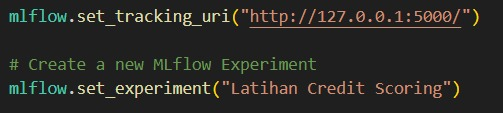

Jika menerapkan skilled, pastikan Anda membuat file modelling_tuning.py dan melakukan logging model yang menghasilkan struktur seperti berikut.
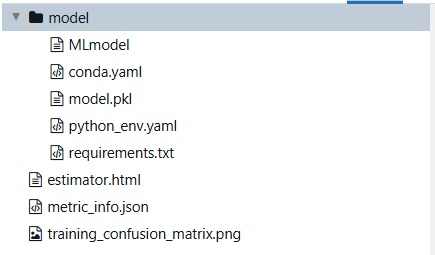

Jika menerapkan advanced, pastikan Anda menambahkan minimal dua artefak selain pada tahapan skilled. Selain itu, Anda harus menyimpan file artefak MLflow ke DagsHub agar dapat diakses secara online.
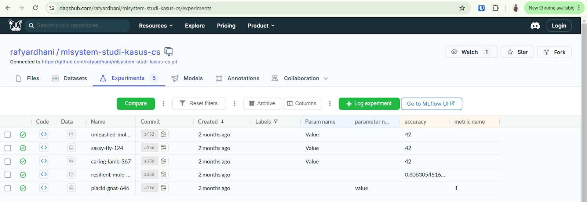

Sebagai contoh, Anda dapat menggunakan kode berikut agar dapat menyimpan artefak pelatihan ke DagsHub.
```python
import dagshub
import mlflow

dagshub.init(repo_owner=’<nama_owner>', repo_name='<nama_repo>', mlflow=True)

with mlflow.start_run():
  # Your training code here...
```

Jika Anda belum memasukkan kredensial apa pun, silakan login terlebih dahulu dengan mengikuti dokumentasi DagsHub.

## Kriteria 3

Silakan Anda buat sebuah repository GitHub dengan visibilitas Public agar bisa diperiksa oleh tim reviewer.

Pastikan Anda membuat workflow dari nol agar dapat memastikan semuanya berjalan dengan baik.

Jangan lupa untuk memasukkan secrets agar informasi akun tidak disalahgunakan orang lain.

Jika Anda menerapkan basic, pastikan workflow CI yang dibuat memuat tahapan berikut.
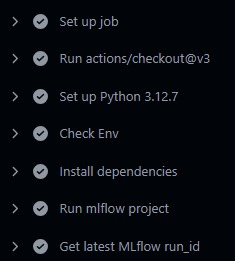

Jika Anda menerapkan  skilled, pastikan workflow CI yang dibuat memuat tahapan berikut.
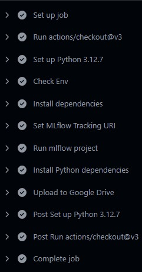

Silakan sesuaikan tahapan “Upload to Google Drive” dengan metode penyimpanan yang Anda pilih seperti “Upload to GitHub” atau “Upload to GitHub LFS”

Jika Anda menerapkan advanced, pastikan workflow CI yang dibuat memuat tahapan berikut.
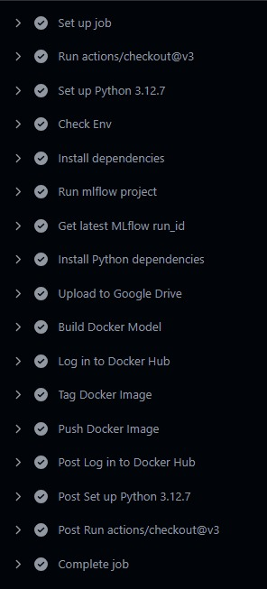

Silakan sesuaikan tahapan “Upload to Google Drive” dengan metode penyimpanan yang Anda pilih seperti “Upload to GitHub” atau “Upload to GitHub LFS”

## Kriteria 4

Pastikan tangkapan layar yang Anda kirim memiliki nama dashboard yang berisikan username akun Dicoding Anda seperti berikut.
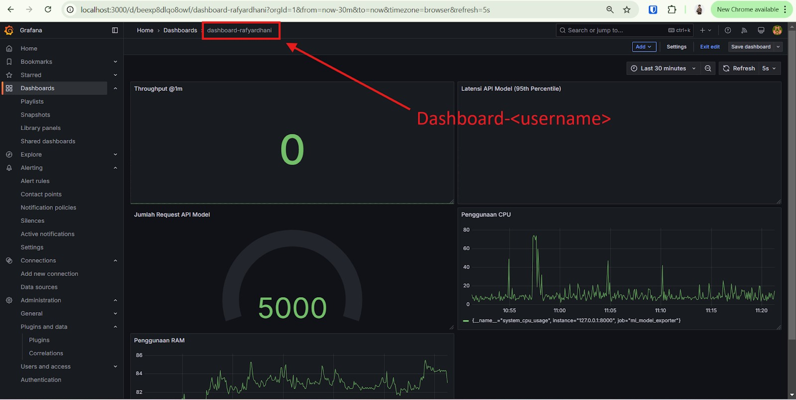

Jika menerapkan basic, silakan lakukan serving model baik itu menggunakan MLflow serve, membuat API menggunakan framework, dan lain sebagainya. Namun, pastikan Anda menyertakan bukti serving seperti berikut ini.
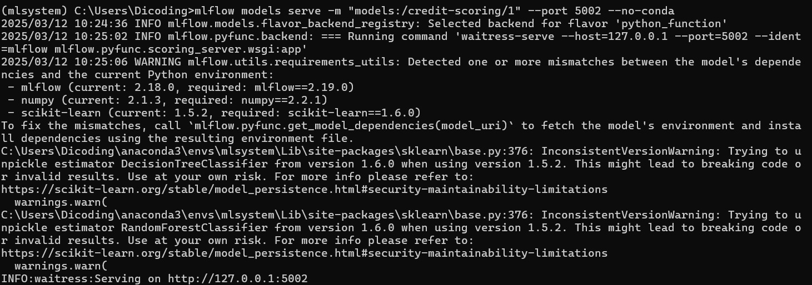
Atau ketika menggunakan Docker Images bisa seperti berikut.

Anda harus menyertakan bukti Prometheus sudah berjalan dengan membuat minimal tiga buah metriks monitoring seperti berikut ini.
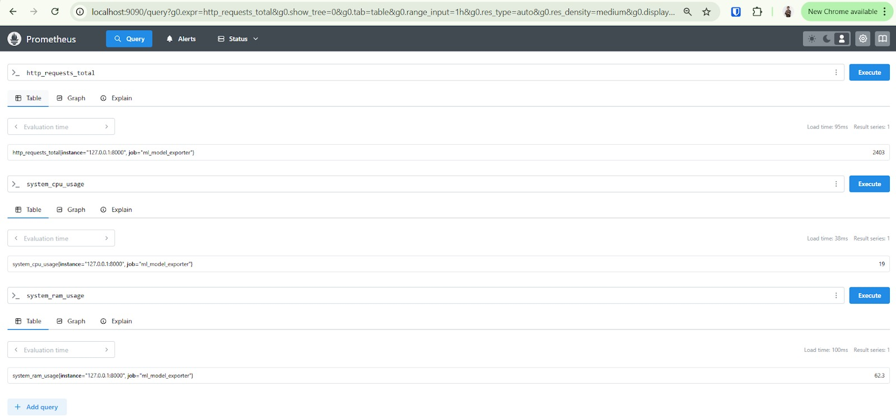

Selanjutnya silakan konversi metriks yang sudah Anda buat menggunakan Prometheus ke Grafana agar visualisasinya lebih baik.

Jika menerapkan Alerting, silakan sisipkan dua file seperti berikut ini.

Bukti rules yang dibuat
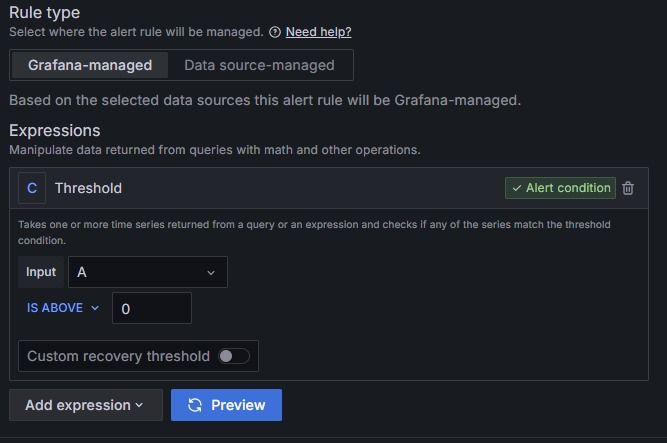

Bukti notifikasi
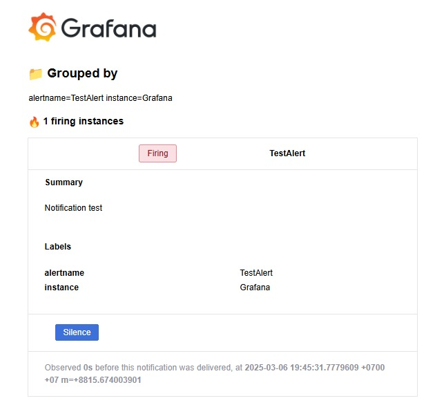


# Lainnya
Ketentuan Pengiriman Berkas Submission
Berkas submission yang dikirimkan merupakan folder berisi kumpulan berkas yang diminta dalam bentuk ZIP seperti contoh berikut.
SMSML_Nama-siswa.zip
├── Eksperimen_SML_Nama-siswa.txt
├── Membangun_model
    ├── modelling.py
    ├── modelling_tuning.py (skilled/advanced)
    ├── namadataset_preprocessing (bisa berupa file atau folder)
    ├── screenshoot_dashboard.jpg
    ├── screenshoot_artifak.jpg
    ├── requirements.txt
    ├── DagsHub.txt (berisikan tautan DagsHub jika menerapkan advanced)
├── Workflow-CI.txt
├── Monitoring dan Logging
    ├── 1.bukti_serving
    ├── 2.prometheus.yml
    ├── 3.prometheus_exporter.py
    ├── 4.bukti monitoring Prometheus (folder)
        └── 1.monitoring_<metriks>
        └── 2.monitoring_<metriks>
        └── dst (sesuaikan dengan poin yang diraih)
    ├── 5.bukti monitoring Grafana (folder)
        └── 1.monitoring_<metriks>
        └── 2.monitoring_<metriks>
        └── dst (sesuaikan dengan poin yang diraih)
    ├── 6.bukti alerting Grafana (folder)
        └── 1.rules_<metriks>
        └── 2.notifikasi_<metriks>
        └── 3.rules_<metriks>
        └── 4.notifikasi_<metriks>
        └── dst (sesuaikan dengan poin yang diraih)
    ├── 7.Inference.py
    ├── folder/file tambahan
Pastikan Anda tidak melakukan ZIP dalam ZIP.


Ketentuan Submission Ditolak
Submission Anda akan ditolak bila

Setiap kriteria submission tidak terpenuhi

## Kriteria 1

Tidak menggunakan template sebagai struktur dasar notebook.

Tidak melakukan tahapan experimentation secara manual. 

Tidak melakukan data loading pada notebook.

Tidak melakukan EDA pada notebook.

Tidak melakukan preprocessing pada notebook.

## Kriteria 2

Tidak membuat model machine learning menggunakan MLflow dan menyimpan artefak di MLflow Tracking UI.

Tidak menyimpan informasi apa pun pada logging.

## Kriteria 3

Tidak membuat folder MLProject.

Tidak membuat workflow CI menggunakan GitHub Actions.

## Kriteria 4

Tidak melakukan serving model pada environment local.

Tidak menggunakan username dicoding sebagai nama dashboard.

Tidak melakukan monitoring performa sistem machine learning menggunakan Prometheus.

Tidak menggunakan Grafana sebagai tools visualisasi dan alerting sistem machine learning.

Mengirimkan tautan kriteria 1 dan 3 tetapi dengan visibilitas Private pada pengaturan GitHub.

Ketentuan berkas submission tidak terpenuhi.

Melakukan kecurangan, seperti tindakan plagiasi.

